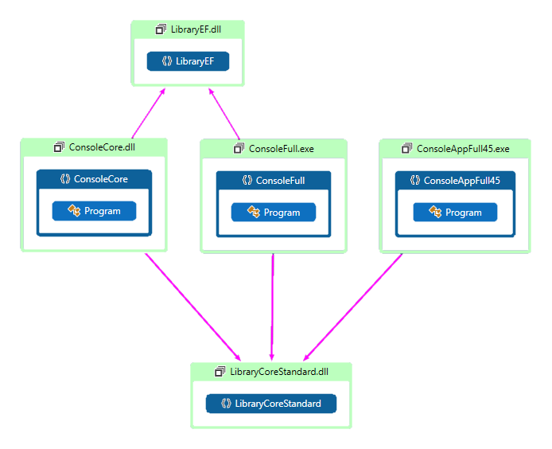

## Este é um exemplo de integração entre o .NET Core e o .NET Standard

Você pode melhorar seu código legado (.NET Framework) criando ou evoluindo partes deste código para .NET Core usando o .NET Standard.

Veja o diretório de PPTs e o exemplo.

### Aqui temos o desenho da aplicação exemplo e como os projetos se conectam:

